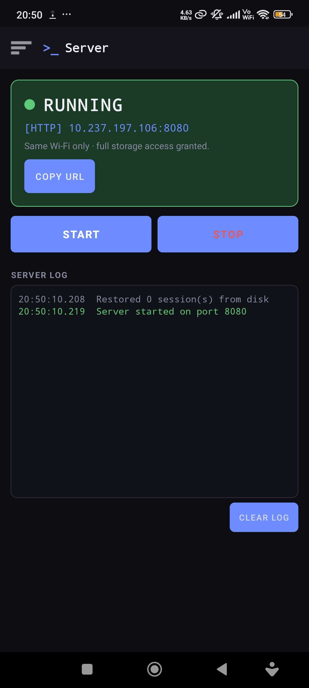
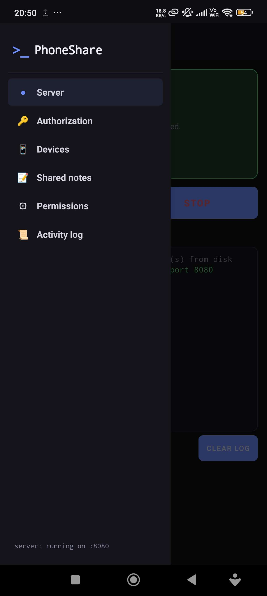
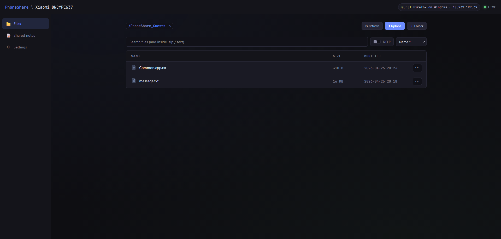

# PhoneShare

A self-hosted file sharing server that runs **on your Android phone**. Browse, upload, download, rename and organize the phone's files from any device on the same Wi-Fi through a clean web UI -- no cloud, no account, no third-party server in the middle.

PhoneShare turns the phone into the host: it runs a local HTTP server, hands out time-limited authorization codes, and lets the phone's owner approve or deny every device that tries to connect.

## Features

- **Local HTTP server** running directly on the phone (no cloud, no relay).
- **Same Wi-Fi only** by design. Connections never leave the LAN.
- **Per-device authorization** with a 6-character code shown on the phone -- approve or deny every stranger from the Authorization screen.
- **Roles**: `ADMIN` (full access) and `GUEST` (restricted to a sandboxed root such as `/PhoneShare_Guests`).
- **Granular per-device permissions**: require explicit approval for download, upload, delete, rename, move, read or mkdir.
- **Web UI** with file browser, deep search inside `.zip` and text files, drag-and-drop upload, folder creation, and shared notes between phone and devices.
- **Activity log** -- every HTTP hit (method, URI, status, latency) is recorded and viewable per device.
- **Session management**: live device list, expiry timers, one-tap disconnect, "forget device" to wipe its saved settings.
- **Notepad sync** -- a shared note per device that both sides can edit.
- **Foreground service + notifications** for connection requests, so approvals can be handled from the lock screen.
- **Full storage access** on Android 11+ via `MANAGE_EXTERNAL_STORAGE` (optional -- without it, only the app's own folder is exposed).

## Screenshots

| Phone -- Server tab | Phone -- Side menu | Browser -- Guest view |
|---|---|---|
|  |  |  |

## How it works

1. **Start the server** from the Server tab. The phone shows its LAN URL (e.g. `http://10.237.197.106:8080`).
2. **Open the URL** in a browser on a laptop / tablet / other phone connected to the same Wi-Fi.
3. The browser is greeted with a 6-character code.
4. On the phone, the request appears in **Authorization -> Strangers waiting**. Approve as `ADMIN` or `GUEST`.
5. The browser is now signed in to a session bound to that device's fingerprint. Future visits from the same device skip the stranger queue (subject to saved permissions).

## Permissions model

Every device has its own settings:

- **Allowed roots** -- one or more absolute paths the device can see.
- **Approval flags** for `download`, `upload`, `delete`, `rename`, `move`, `read`, `mkdir`. When a flag is on, the action triggers a notification on the phone and only proceeds after the owner approves.
- **Role** -- `ADMIN` defaults to no approvals required (full trust); `GUEST` defaults to the sandbox root and approvals on destructive actions.

All settings are editable per-device from the Devices screen.

## Build

Open the project in Android Studio (Hedgehog or newer) and run on a device or emulator running **Android 8.0 (API 26)** or above. Storage is more useful on Android 11+ once `MANAGE_EXTERNAL_STORAGE` is granted.

```bash
./gradlew assembleDebug
# APK at: app/build/outputs/apk/debug/app-debug.apk
```

## Security notes

- PhoneShare is meant for use on a **trusted local network**. There is no TLS yet -- all traffic is plain HTTP.
- The server binds to all interfaces on the chosen port. If the phone is on a public Wi-Fi, stop the server.
- Authorization codes are short-lived; sessions can be revoked at any time from the Devices screen.
- "Forget device" wipes saved settings and shared notes for that device.

## Tech stack

- **Kotlin** + standard AndroidX (Fragments, AppCompat, Material).
- **NanoHTTPD**-style server implemented in `PhoneShareServer.kt` (single-file, no external HTTP framework).
- Static front-end (`index.html`, `app.js`, `style.css`) served from the app's `assets/`.
- Foreground `Service` (`WebServerService.kt`) keeps the server alive.

## License

See [LICENSE](LICENSE).
